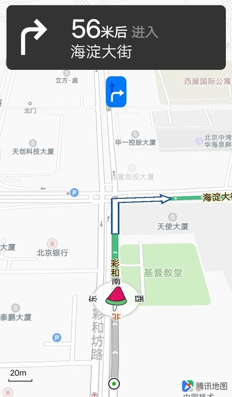
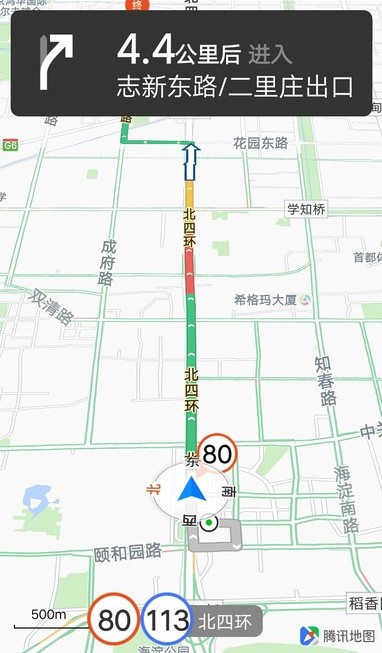
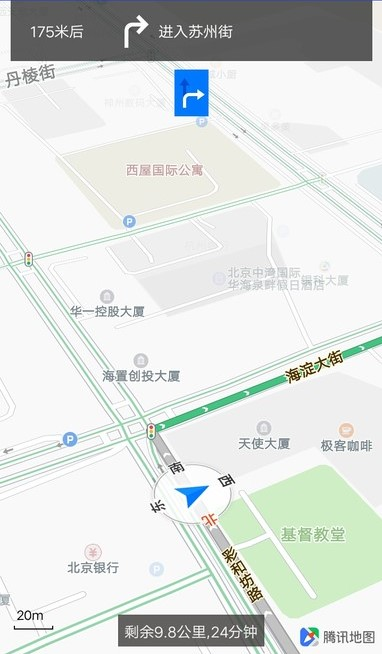

# 目录

- [key配置](#KeySet)
- [工程配置](#ProSet)
- [权限配置](#manifest)
- [混淆配置](#proguard)
- [驾车路径规划](#NaviPlan)
- [实时导航](#RealNavi)
- [模拟导航](#SimuNavi)
- [导航配置设置](#NaviSet)
- [获取导航数据](#DataGet)
- [导航UI自定义](#UiDesign)


### 介绍
腾讯导航 SDK 是一款针对在线导航的产品。该产品的路径计算与实时交通信息相结合，提供路径规划、模拟导航、实时导航、导航设置、自定义导航界面等功能，力求为用户提供更加人性化的导航服务。

兼容性：支持 Android 4.0 及以上系统。

<div id="KeySet"></div>

### Key配置
------------
用户在 [http://lbs.qq.com/console/mykey.html](http://lbs.qq.com/console/mykey.html) 申请开发者权限，然后把Key输入工程的AndroidManifest.xml文件中，在application节点里，添加名称为TencentMapSDK的meta，如下所示：
```xml
<application
    android:allowBackup="true"
    android:icon="@drawable/ic_launcher"
    android:label="@string/app_name"
    android:theme="@style/AppTheme" >
    <meta-data
      android:name="TencentMapSDK"
      android:value="输入申请的开发者权限"/>
</application>
```
<div id="ProSet"></div>

### 工程配置
------------

这里我们只提供eclipse和Android Studio的腾讯导航SDK的工程配置方法。

**1、eclpise** 

首先将 * .aar文件通过解压工具解压，将classes.jar文件拖放到libs文件夹中，删除jni文件夹以及R.txt和proguard.txt文件，在解压得到的目录里创建project.properties文件，添加：
```
target=android-22  
android.library=true
```
在Eclipse环境下导入我们编辑完成的类库。

**2、Android Studio**

**使用maven**

首先工程顶级 build.gradle 文件中加入：
```
buildscript {
    repositories {
        maven{
            url "https://oss.sonatype.org/content/groups/public"
        }
        mavenLocal()
        mavenCentral()
        jcenter()
        google()
    }
}
```
然后module build.gradle 文件中添加依赖库名称：
```
dependencies {
    implementation 'com.tencent.map:tencent-map-nav-sdk:latest.release'//获取最新版本号
}
```
最后rebuild一下即可。

**使用aar包**

将下载到的"\*.aar"拷贝到app/libs/文件夹下。
然后在module的build.gradle里修改dependencies，添加：`implementation fileTree(dir: 'libs', include: ['*.jar','*aar'])`，rebuild一下即可。

<div id="manifest"></div>

### 权限设置
------------
SDK需要使用网络，访问硬件存储等系统权限，在AndroidManifest.xml文件里，添加如下权限：
```xml
    <!-- 通过GPS得到精确位置 -->
    <uses-permission android:name="android.permission.ACCESS_FINE_LOCATION" />
    <!-- 通过网络得到粗略位置 -->
    <uses-permission android:name="android.permission.ACCESS_COARSE_LOCATION" />
    <uses-permission android:name="android.permission.ACCESS_MOCK_LOCATION" />
    <!-- 访问WiFi状态 -->
    <uses-permission android:name="android.permission.ACCESS_WIFI_STATE" />
    <!-- 修改WiFi状态，发起WiFi扫描 -->
    <uses-permission android:name="android.permission.CHANGE_WIFI_STATE" />
    <!-- 访问网络状态, 检测网络的可用性，需要网络运营商相关信息用于网络定位 -->
    <uses-permission android:name="android.permission.ACCESS_NETWORK_STATE" />
    <!-- 访问网络的变化 -->
    <uses-permission android:name="android.permission.CHANGE_NETWORK_STATE" />
    <!-- 读写手机SD卡权限 -->
    <uses-permission android:name="android.permission.WRITE_EXTERNAL_STORAGE" />
    <uses-permission android:name="android.permission.READ_EXTERNAL_STORAGE" />
```
<div id="proguard"></div>

### 混淆配置
------------
在module里找到proguard-rules.pro文件，添加：
```
-dontwarn com.qq.taf.**
-keep class com.qq.taf.** { *; }

-keep public class com.tencent.map.ama.navigation.data.NavigationJNI {*;}
-keep public class com.google.webp.libwebpJNI {*;}

-dontwarn sun.misc.Unsafe
-keep, includedescriptorclasses public class com.tencent.map.lib.gl.JNI { *;}
-keep, includedescriptorclasses public class com.tencent.map.lib.gl.* { *;}
-keep, includedescriptorclasses public class com.tencent.tencentmap.mapsdk.maps.a.* { *;}
```
然后在module的build.gradle文件中引用该混淆文件：
```

    buildTypes {
        release {
            minifyEnabled false
            proguardFiles getDefaultProguardFile('proguard-android.txt'), 'proguard-rules.pro'
        }
    }
```
<div id="NaviPlan"></div>

### 驾车路径规划
------------

#### 基本介绍
根据起点、终点、途径点以及路径策略，给用户提供出行路线。
方法：searchRoute

```java
public void searchRoute(NaviPoi from,
                        NaviPoi to,
                        java.util.ArrayList waypoints,
                        CarRouteSearchOptions carSearchOptions,
                        TencentRouteSearchCallback tencentSearchCallback)
                 throws java.lang.Exception
```
参数：

-  from： 起点经纬度，NotNull
-  to： 终点经纬度，NotNull
-  waypoints ：途经点，最多设置三个
-  carSearchOptions： 路线查询配置参数
-  tencentSearchCallback ：路线查询回调


**路线查询配置说明：**

导航SDK提供3种算路配置策略，接送客场景以及起点路段类型选择。可以配置是否避开收费站，是否不走高速，是否躲避拥堵，设置接送客场景，起点路段类型。默认情况下的配置是：不避开收费站，走高速，不躲避拥堵，接客场景，路段类型为0无提示。

算路配置方法概览：

- avoidToll(boolean avoidToll)：设置避开收费站
- avoidHighway(boolean avoidHighway) ：设置不走高速公路
- avoidCongestion(boolean avoidCongestion)：设置是否躲避拥堵
- naviScene(int naviScene)：设置接送客场景，1: 接客 2: 送客
- startRoadType(int roadType) ：设置起点路段类型，0为无提示，1为在桥上，2为在桥下，3为在主路，4为在辅路，5为在对面，6为桥下主路，7为桥下辅路；默认为0。

**算路失败回调错误码说明：**

errorCode - 错误码:

- 1001为网络错误
- 1002为无网络
- 2001为返回数据无效（或空）
- 2002为起终点参数错误
- 2003为途经点参数错误
- 2004为吸附失败
- 2005为算路失败
- 2999为服务器内部错误

#### 使用说明

**第1步，初始化**

获取TencentCarNaviManager实例：
```java
 TencentCarNaviManager mTencentCarNaviManager = new TencentCarNaviManager(this);
```
**第2步，创建算路回调**

```java
private TencentRouteSearchCallback mTencentSearchCallback = new TencentRouteSearchCallback() {
        @Override
        public void onRouteSearchFailure(int errorCode, String errorMessage) {
            Log.e(TAG,"算路失败回调");
            
        }

        @Override
        public void onRouteSearchSuccess(ArrayList<RouteData> routes) {
            Log.e(TAG,"算路成功回调");
            //拿到路线数据routes:路线距离，路线推荐理由，路线点串，预估时间，路况数据列表等
        }
    };
```
**第3步，发起路径规划**

```java
//构造起点、终点、途径点
private NaviPoi startPoint = new NaviPoi(39.984110, 116.307590);// 起点
private NaviPoi destPoint = new NaviPoi(39.994868, 116.406058); // 终点
private ArrayList<NaviPoi> wayPoints = new ArrayList<NaviPoi>(); // 途经点
wayPoints.add(new NaviPoi(39.994169,116.381199));//添加第一个途径点
wayPoints.add(new NaviPoi(39.994926,116.394138));//添加第二个途径点
//算路配置
private CarRouteSearchOptions options = CarRouteSearchOptions.create();
options = options.avoidHighway(true);//设置不走高速
//发起路线规划
tencentCarNaviManager.searchRoute(startPoint,destPoint, wayPoints, options, mTencentSearchCallback);

```
**第4步，处理算路结果**

通过TencentRouteSearchCallback的回调方法拿到路线数据，路线距离，路线推荐理由，路线点串，预估时间，路况数据列表等。
```java
 @Override
        public void onRouteSearchSuccess(ArrayList<RouteData> routes) {
            Log.e(TAG,"算路成功回调");
            //拿到路线数据routes:路线距离，路线推荐理由，路线点串，预估时间，路况数据列表等
        }
    };
```
<div id="RealNavi"></div>

### 实时导航
------------


#### 基本介绍
实时导航是基于用户真实的定位信息来驱动的导航过程。路线规划完成后，就可以开始实时导航。

方法：

- 开启实时导航：startNavi(int routeIndex)
会获得路线数据RouteData的数组，这里需要传入的routeIndex指的就是RouteData在数组中的index。

- 停止实时导航：stopNavi()。

**导航界面：**

腾讯导航SDK提供了默认的导航界面CarNaviView，包括导航面板、导航地图。

导航面板：

- 导航Title：转向箭头、距离下一个转弯事件的距离、下一条道路名称
- 车道线
- 电子眼放大图
- 路口放大图

导航地图：

- 地图
- 线路：蚯蚓线、当前道路名称、道路指示箭头
- 起点、终点、途径点marker
- 车标
- 罗盘
- 电子眼

#### 使用说明
**第1步，定义CarNaviView**

在layout文件中定义CarNaviView。
```xml
<?xml version="1.0" encoding="utf-8"?>
<RelativeLayout xmlns:android="http://schemas.android.com/apk/res/android"
    android:layout_width="match_parent"
    android:layout_height="match_parent" >
    <com.tencent.map.navi.car.CarNaviView
        android:id="@+id/car_navi_view"
        android:layout_width="match_parent"
        android:layout_height="match_parent"/>
</RelativeLayout>
```
**第2步，初始化**

```java
    //获取CarNaviView实例：
    mCarNaviView = findViewById(R.id.car_navi_view);
    //创建TencentCarNaviMangaer实例：
    mTencentCarNaviManager = new TencentCarNaviManager(context);
    //用户需要添加默认的导航面板协议CarNaviView，用于接收导航面板数据更新。如需自定义，可以实现INaviView协议的实例（可传入多个，用于自定义导航面板）：
    mTencentCarNaviManager.addNaviView(mCarNaviView);
    //设置导航状态回调——TencentNaviCallback：
    private TencentNaviCallback mTencentNaviCallback = new TencentNaviCallback() {
     @Override
        public void onArrivedDestination() {
        }
        ......
         @Override
        public int onVoiceBroadcast(NaviTts tts) {
        }
    };
    mTencentCarNaviManager.setNaviCallback(mTencentNaviCallback);

```
**第3步，地图生命周期控制**

生命周期管理方法，用户需要在对应生命周期回调方法中，主动调用。
```java
@Override
    protected void onStart() {
        if (carNaviView != null) {
            carNaviView.onStart();
        }
        super.onStart();
    }

    @Override
    protected void onRestart() {
        if (carNaviView != null) {
            carNaviView.onRestart();
        }
        super.onRestart();
    }

    @Override
    protected void onResume() {
        if (carNaviView != null) {
            carNaviView.onResume();
        }
        super.onResume();
    }

    @Override
    protected void onPause() {
        if (carNaviView != null) {
            carNaviView.onPause();
        }
        super.onPause();
    }

    @Override
    protected void onStop() {
        if (carNaviView != null) {
            carNaviView.onStop();
        }
        super.onStop();
    }

    /**
     * 销毁导航实例
     */
    @Override
    protected void onDestroy() {
        if (carNaviView != null) {
            carNaviView.onDestroy();
        }
        super.onDestroy();
    }

```
**第4步，发起路线规划**

具体参考：路线规划

**第5步，开始导航**

路线规划成功后，从路线规划回调中拿到路线，用于导航。
```java
 @Override
        public void onRouteSearchSuccess(ArrayList<RouteData> routes) {
            Log.e(TAG,"算路成功回调");
            //拿到路线数据routes
            //使用第一条路线进行导航
            mTencentCarNaviManager.startNavi(0);
        }
    
```
发起导航可以使用` tencentCarNaviManager.startNavi();`

**第6步，结束导航**

导航结束，会自动结束导航。用户在导航过程中需要结束导航，可以使用:
```java
    tencentCarNaviManager.stopNavi();
```
<div id="SimuNavi"></div>

### 模拟导航
------------

#### 基本介绍
模拟导航是基于线路模拟点驱动的导航过程，可以帮助用户预先了解路线情况。

方法：

- 开启模拟导航：startSimulateNavi(int routeIndex) 
会获得路线数据RouteData的数组，这里需要传入的routeIndex指的就是RouteData在数组中的index。

- 停止模拟导航：stopSimulateNavi()

#### 使用说明
模拟导航的使用步骤同实时导航的步骤基本一致。可参考实时导航使用说明。
```java
//开启模拟导航
mTencentCarNaviManager.startSimulateNavi(0);
//关闭模拟导航
mTencentCarNaviManager.stopSimulateNavi() ;
```

<div id="NaviSet"></div>

### 导航配置设置
------------
用户可以设置导航过程中是否加载路口放大图等资源，设置是否使用自定义的导航marker，设置日夜模式以及导航模式。这些设置都是及时生效的。

#### 设置是否开启导航功能
```java
//设置不开启路口放大图功能
tencentCarNaviManager.setEnlargedIntersectionEnabled(false)
//设置不开启车道线功能
tencentCarNaviManager.setGuidedLaneEnabled(false)
```

#### 设置是否使用默认资源：
首先将sdk中assets下的图片都可以自定义。如小车marker、起点终点marker、电子眼marker、车道线箭头图片等。使用时需要将同名文件放到module下的assets目录下。
然后设置不使用默认资源`   tencentCarNaviManager.setIsDefaultRes(false) `




#### 设置导航线路：
```java
//设置导航路线宽度
.setNaviLineWidth(25); 
//设置路线擦除类型，0为置灰已走路线，1为擦除已走路线。
mCarNaviView.setRouteEraseType(0);
```

#### 设置车标位置：
```java
//设置导航过程中3d模式下，车标位于地图宽高的比例，默认x坐标为0.5 ，y坐标为0.75
mCarNaviView.setNaviFixingProportion3D(0.5,0.5);
//设置导航过程中2d模式下，车标位于地图宽高的比例，默认x坐标为0.5 ，y坐标为0.75
mCarNaviView.setNaviFixingProportion2D(0.5,0.5);
```

#### 设置导航日夜模式：
通过`mCarNaviView.setDayNightMode(DayNightMode dayNightMode)`方法设置日夜模式。默认为自动切换模式。可以通过`mCarNaviView.isNightStatus()`判断当前是否为夜间状态。

日夜切换模式DayNightMode：

- 自动切换模式：AUTO MODE,设置为该模式，则导航SDK将通过对当前时间和经纬度的判断，适时切换到日间或夜间状态.
- 日间模式：DAY MODE,设置为该模式，则导航过程中将始终为日间状态.
- 夜间模式：NIGHT MODE,夜间模式.设置为该模式，则导航过程中将始终为夜间状态.

#### 设置导航模式：
通过`mCarNaviView.setNaviMode(NaviMode naviMode) `方法设置导航模式。默认为3D车头向上模式。可以通过`mCarNaviView.getNaviMode() `获取当前导航模式。

导航模式NaviMode:

- 3D最佳视野：MODE_3DCAR_TOWARDS_UP ，3D车头朝上模式.该模式下，车头始终保持指向屏幕上方，地图进行旋转并动态调整缩放级别.
- 2D最佳视野：MODE_2DMAP_TOWARDS_NORTH ，  2D地图朝北模式.该模式下，车头进行旋转，地图保持上北下南并动态调整缩放级别.
- 2D全览模式：MODE_OVERVIEW ，2D路线全览模式.该模式下,车头进行旋转，地图保持上北下南，同时会始终展示整条导航路线.
- 剩余全览模式：MODE_REMAINING_OVERVIEW,剩余路线全览模式。该模式下,车头进行旋转，地图保持上北下南，同时会始终展示整条导航路线的剩余部分。
- 回弹模式：MODE_BOUNCE  ，无状态模式.导航态中，用户滑动地图后进入该模式.

<div id="DataGet"></div>

### 获取导航面板数据
------------
用户若需要自定义导航面板，可以实现InaviView协议从而获取面板数据。
```java
class CustomNaviView implements INaviView{
    //接口实现
    //获取数据，自定义UI
    @Override
        public void onShowEnlargedIntersection(Bitmap bitmap) {
            //获取路口放大图资源
        }
        @Override
        public void onHideEnlargedIntersection() {
            //隐藏路口放大图
        }
        @Override
        public void onShowGuidedLane(Bitmap bitmap) {
            //获取车道线资源
        }
        @Override
        public void onHideGuidedLane() {
            //隐藏车道线
        }
        @Override
        public void onUpdateTraffic(int i, int i1, ArrayList<TrafficItem> arrayList) {
          //获取更新导航线路路况的信息。
        }
        @Override
        public void onGpsRssiChanged(int i) {
          //得知GPS信号变化，可用于绘制卫星信号。
        }
        @Override
        public void onUpdateNavigationData(NavigationData navigationData) {
             //获取导航面板数据，自定义导航面板
        }
}
private customNaviView = new CustomNaviView();
//添加自定义导航面板
tencentCarNaviManager.addNaviView(customNaviView);
```
**导航面板数据：**

用户可以通过onUpdateNavigationData(NavigationData data) 获取导航面板所需数据。

**NavigationData：**

- 获取当前道路路名 java.lang.String  getCurrentRoadName()
-  获取当前速度 int  getCurrentSpeed() 
-  获取当前道路剩余距离 int  getDistanceToNextRoad() 
-  获取总剩余距离 int  getLeftDistance() 
-  获取总剩余时间 int  getLeftTime() 
-  获取当前道路限速 int  getLimitSpeed() 
-  获取下一道路路名 java.lang.String getNextRoadName() 
-  获取转向箭头图片 android.graphics.Bitmap  getTurnIcon() 


<div id="UiDesign"></div>

### 自定义UI
------------

#### 添加面板控件

获取的导航数据可以用来添加导航面板控件，自定义导航面板。
1. 添加布局文件：

```xml
<?xml version="1.0" encoding="utf-8"?>
<android.support.constraint.ConstraintLayout xmlns:android="http://schemas.android.com/apk/res/android"
    xmlns:app="http://schemas.android.com/apk/res-auto"
    xmlns:tools="http://schemas.android.com/tools"
    android:layout_width="match_parent"
    android:layout_height="match_parent"
    android:clickable="true">
     <com.tencent.map.navi.car.CarNaviView
        android:id="@+id/car_navi_view"
        android:layout_width="match_parent"
        android:layout_height="match_parent"/>
    <TextView
        android:id="@+id/navi_road_name"
        android:layout_width="wrap_content"
        android:layout_height="30dp"
        />

    <TextView
        android:id="@+id/navi_speed"
        android:layout_width="50dp"
        android:layout_height="50dp"
        />

    <TextView
        android:id="@+id/navi_limit_speed"
        android:layout_width="50dp"
        android:layout_height="50dp"
     />
</android.support.constraint.ConstraintLayout>
```
2. 实现InaviView的 onUpdateNavigationData（）：

```java
        @Override
        public void onUpdateNavigationData(NavigationData navigationData) {
            roadName.setText(navigationData.getCurrentRoadName());
            speed.setText(navigationData.getCurrentSpeed()+"");
            limitSpeed.setText(navigationData.getLimitSpeed()+"");
        }
```


#### 自定义导航面板

1.添加布局文件

```xml
<?xml version="1.0" encoding="utf-8"?>
<android.support.constraint.ConstraintLayout xmlns:android="http://schemas.android.com/apk/res/android"
    xmlns:app="http://schemas.android.com/apk/res-auto"
    xmlns:tools="http://schemas.android.com/tools"
    android:layout_width="match_parent"
    android:layout_height="match_parent"
    android:clickable="true">
    <com.tencent.map.navi.car.CarNaviView
        android:id="@+id/car_navi_view"
        android:layout_width="match_parent"
        android:layout_height="match_parent"/>
    <android.support.constraint.ConstraintLayout
        android:id="@+id/constraintLayout"
        android:layout_width="match_parent"
        android:layout_height="57dp"
        >

        <TextView
            android:id="@+id/left_dis_next"
            android:layout_width="71dp"
            android:layout_height="23dp"
            android:text="200米后"
      />

        <ImageView
            android:id="@+id/turn_next"
            android:layout_width="43dp"
            android:layout_height="40dp"
             />

        <TextView
            android:id="@+id/road_next"
            android:layout_width="200dp"
            android:layout_height="23dp"
            android:text="进入"
            />
    </android.support.constraint.ConstraintLayout>

    <ImageView
        android:id="@+id/lane"
        android:layout_width="wrap_content"
        android:layout_height="wrap_content" />

    <TextView
        android:id="@+id/left_time_dis"
        android:layout_width="wrap_content"
        android:layout_height="30dp"
        android:text="剩余距离时间"/>
</android.support.constraint.ConstraintLayout>
```

2 . 实现INaviView协议

```java

    //实现InaviView协议
    private INaviView customView = new INaviView() {
        @Override
        public void onGpsRssiChanged(int i) {
        }

        @Override
        public void onUpdateNavigationData(NavigationData navigationData) {
            //更新导航面板数据
            leftDisNext.setText(formatDis(navigationData.getDistanceToNextRoad())+"后");

            setLeftTimeDis(navigationData.getLeftTime(),navigationData.getLeftDistance());
            roadNext.setText("进入"+navigationData.getNextRoadName());
            turnNext.setImageBitmap(navigationData.getTurnIcon());

        }

        @Override
        public void onShowEnlargedIntersection(Bitmap bitmap) {

        }

        @Override
        public void onHideEnlargedIntersection() {

        }

        @Override
        public void onShowGuidedLane(Bitmap bitmap) {
            //设置车道线
            lane.setImageBitmap(bitmap);
        }

        @Override
        public void onHideGuidedLane() {

        }

        @Override
        public void onUpdateTraffic(int i, int i1, ArrayList<TrafficItem> arrayList) {

        }
    };
    //格式化距离
    private String formatDis(int dis){
        DecimalFormat df = new DecimalFormat("0.0");
        String distance;
        if(dis>=1000){
            distance =df.format(dis/1000.0)+"公里";
        }else {
            distance = +dis+"米";
        }
        return distance;
    }
    //设置距离时间输出样式
    private void setLeftTimeDis(int time, int dis){

        String content = "";
        content = "剩余"+formatDis(dis)+",";
        if(time>60){
            content +=time/60+"小时";
        }else {
            content+=time+"分";
        }
        leftTimeDis.setText(content);
    }
```

3. 在TencentCarNaviManager中添加协议

```java
        //隐藏默认的导航面板
        if(carNaviView!=null){
            carNaviView.setNaviPanelEnabled(false);
        }
        if(tencentCarNaviManager!=null){
            //添加导航协议
            tencentCarNaviManager.addNaviView(customView);
        }
```

